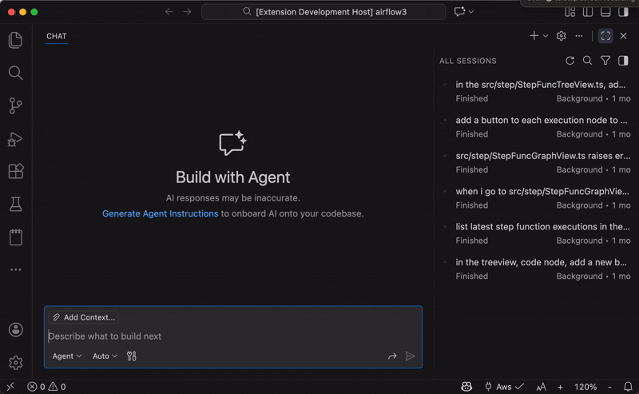
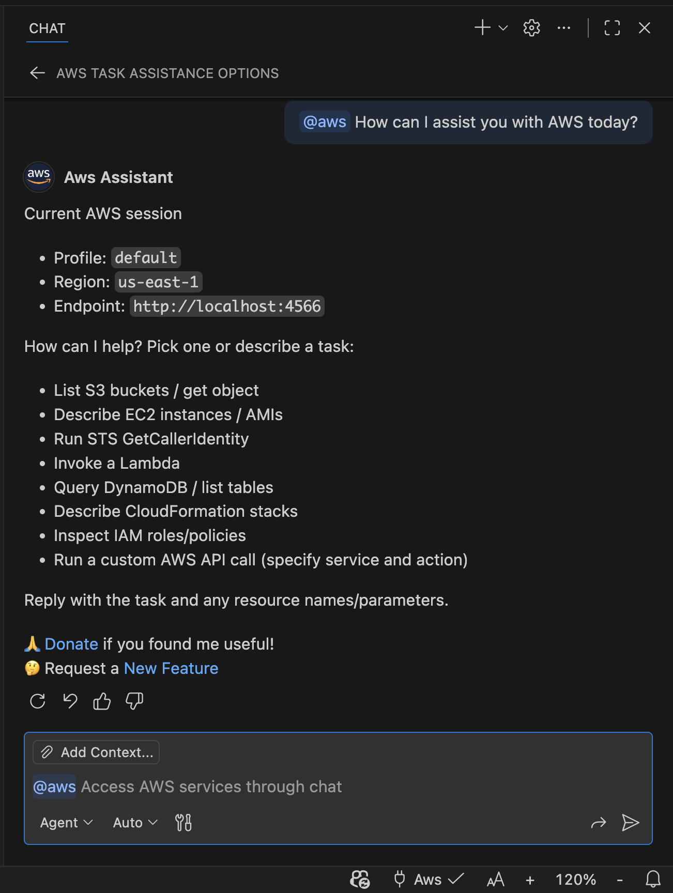
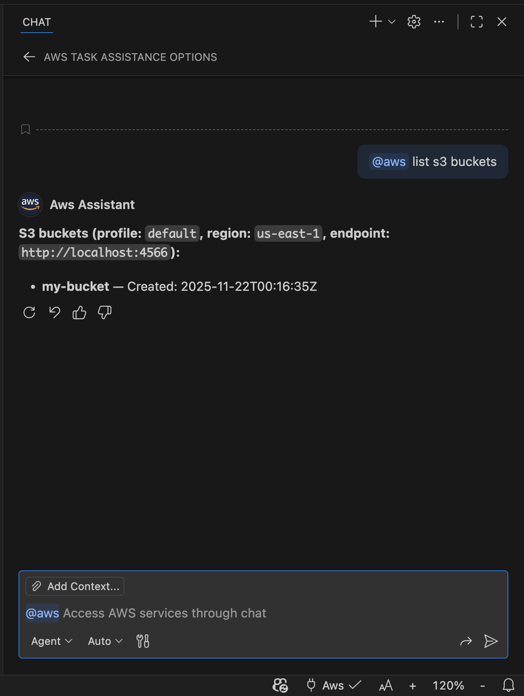
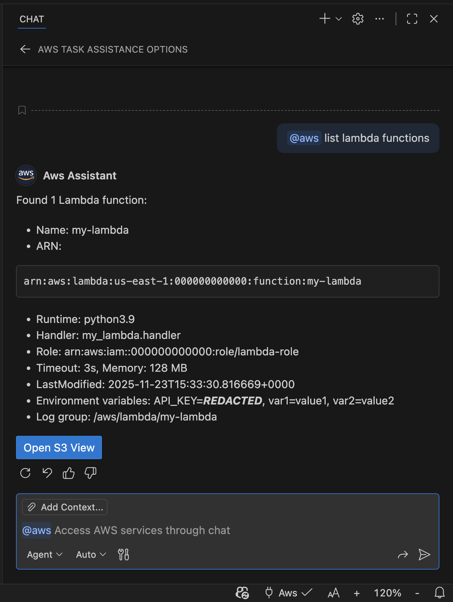
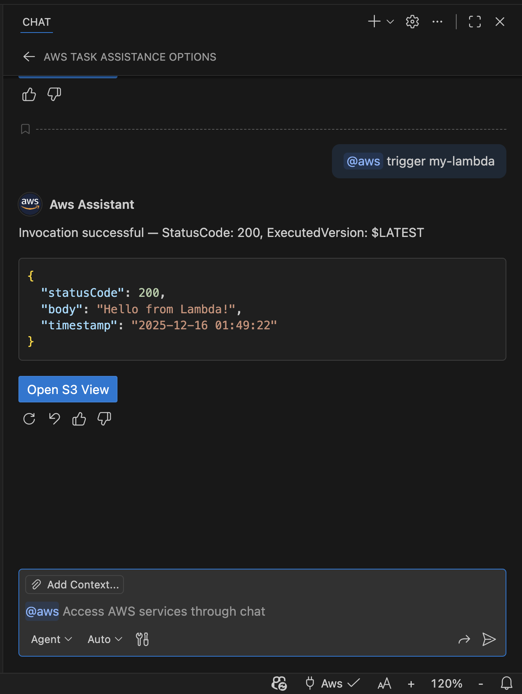
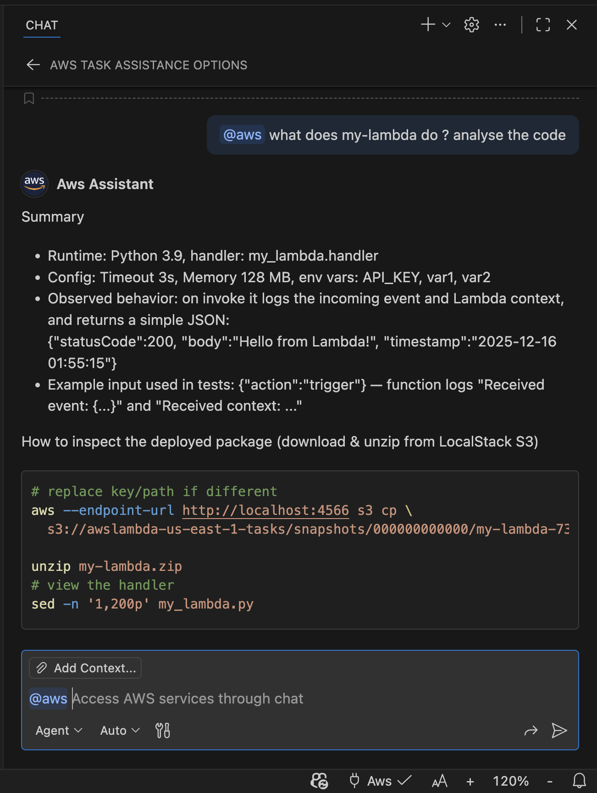
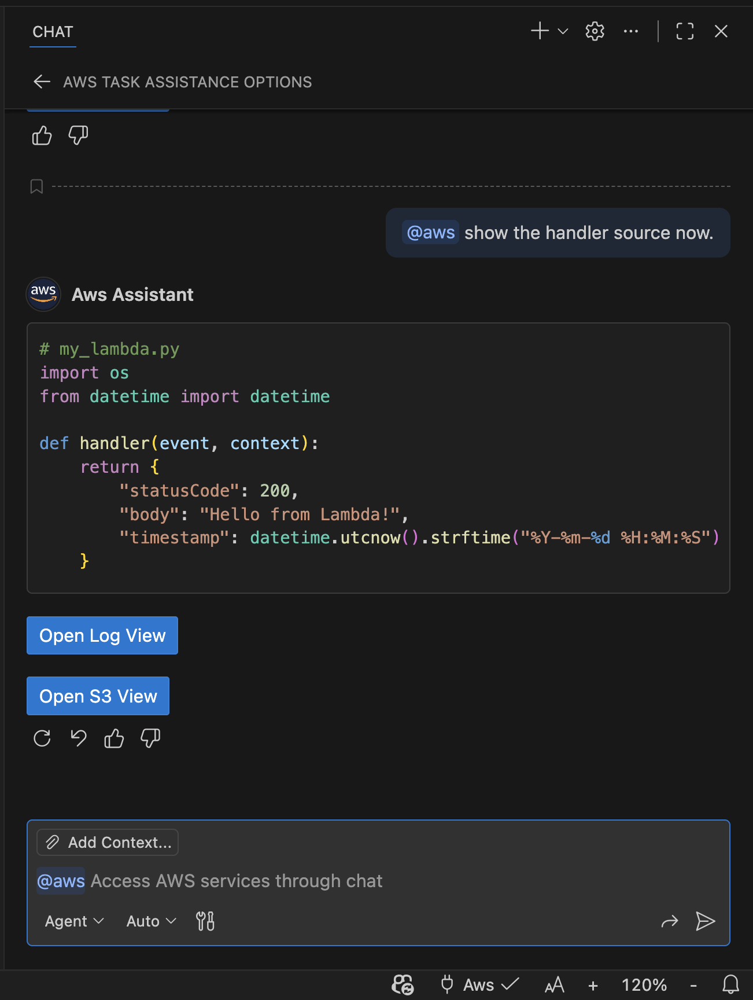

# Goggles: AWS AI Assistant

Goggles is a Visual Studio Code extension that brings AWS management into your chat experience. Use natural language to inspect and operate AWS resources with your existing credentials. The extension exposes AWS-aware tools that execute actions directly on your behalf.

## 🔑 Supported AWS Services
- S3
- SQS
- SNS
- EC2
- Lambda
- Step Functions
- EMR
- CloudWatch Logs
- CloudFormation
- RDS
- DynamoDB
- IAM
- STS
- Glue
- API Gateway

Click [here](README_AWS_SERVICES.md) for the full list of supported AWS services and actions.

## 🤖 Available Tools
- **Session & STS**: manage profile/region/endpoint, refresh credentials, GetCallerIdentity, session tokens.
- **S3**: list buckets/objects, get/put/delete objects.
- **SQS & SNS**: list queues/topics, send/receive/delete messages, get queue URLs.
- **EC2**: describe instances, images, VPCs, security groups, console output.
- **Lambda & Step Functions**: invoke functions, list state machines and executions.
- **EMR**: describe clusters, steps, studios, notebook executions, and scaling policies.
- **CloudWatch Logs**: search and retrieve log events.
- **CloudFormation**: list stacks, describe stack resources and events.
- **RDS & RDS Data**: list DB instances/clusters; run SQL via RDS Data API.
- **DynamoDB**: list tables, describe tables, scan/query items.
- **IAM & STS**: identity and credential utilities.
- **API Gateway, Glue**: service management and S3-compatible endpoint support.
- **File Operations**: work with local workspace context.

## 🤔 What You Can Do

- Ask "@aws" in the chat to inspect or operate AWS services using built-in tools.
- Switch profiles, regions, and endpoints using your local AWS CLI credentials.
- Test connectivity via STS GetCallerIdentity before running commands.
- Browse CloudWatch Logs, invoke Lambda functions, interact with SQS/SNS, manage EC2 resources, work with S3 objects, and query RDS/DynamoDB with guided prompts.
- Use VS Code commands and the status bar to change AWS context quickly.

## ❓ Q & A
- **Q**: How does Goggles authenticate to AWS?
- **A**: It uses your existing AWS credentials configured locally (via AWS CLI config, SSO, environment variables, etc.) and the AWS SDK provider chain.

- **Q**: Are my AWS credentials stored by the extension?
- **A**: No, credentials are not persisted outside VS Code global state. You can refresh or clear cached credentials from the Command Palette.

- **Q**: What permissions are required?
- **A**: The extension invokes AWS APIs using your account permissions. Use least-privilege IAM policies and verify the active profile before running mutating actions.

- **Q**: Can I use this extension with multiple AWS accounts?
- **A**: Yes, you can switch profiles using the status bar AWS selector or commands in the Command Palette.

- **Q**: Is there any cost associated with using this extension?
- **A**: The extension itself is free to use, but AWS API calls may incur costs based on your usage and AWS pricing.

- **Q**: Are my AWS Credentials exposed to Copilot or other AI services?
- **A**: No, your AWS Credentials are handled locally by the extension and are not sent to any external AI services.

- **Q**: Is it possible the extension could perform unintended actions on my AWS account?
- **A**: The extension always gets confirmation from you for the actions below before executing them:
   - put, post, upload, download, delete, copy, create, update, insert, commit, rollback, send, publish, invoke, start, execute. 
   - List, get, describe, search, scan, query actions are read-only and safe.

## 📺 Screenshots

| | | |
|---|---|---|
|  |  |  |
|  |  |  |
|  |  |  |
|  |  |  |
|  |  |  |

## ⚙️ Prerequisites

- AWS credentials configured locally (via AWS CLI config, SSO, environment variables, or other supported methods).

## 📋 Quick Start

1. **Set profile/region**: Use the status bar AWS selector or run "Goggles: Set AWS Profile" / "Goggles: Set Default Region" from the Command Palette.
2. **Test connectivity**: Run "Goggles: Test AWS Connectivity" to verify STS access.
3. **Open Chat**: Open Chat (@aws) and ask a question, for example:
   - List my S3 buckets
   - Tail the latest CloudWatch log events for /aws/lambda/my-fn
   - Describe EC2 instances in us-west-2
   - Publish a message to my SNS topic
4. **Review results**: The assistant will call the appropriate tool, stream results, and suggest follow-up actions.

## 👮 Authentication & Security

- **Credentials**: Resolved via the AWS SDK provider chain. The selected profile is stored in VS Code global state and reapplied across sessions.
- **Privacy**: No credentials are persisted outside VS Code global state. You can refresh or clear cached credentials from the Command Palette.
- **Permissions**: The assistant invokes AWS APIs using your account permissions. Use least-privilege IAM policies and verify the active profile before running mutating actions.

## 💖 Links

- **Issues & Feature Requests**: https://github.com/necatiarslan/aws-ai-assistant/issues
- **Sponsor**: https://github.com/sponsors/necatiarslan
- **License**: MIT
